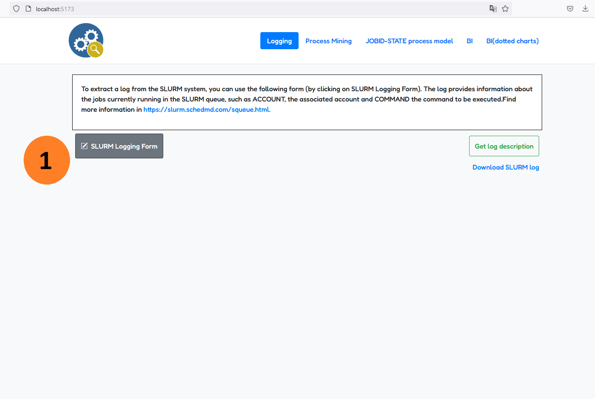
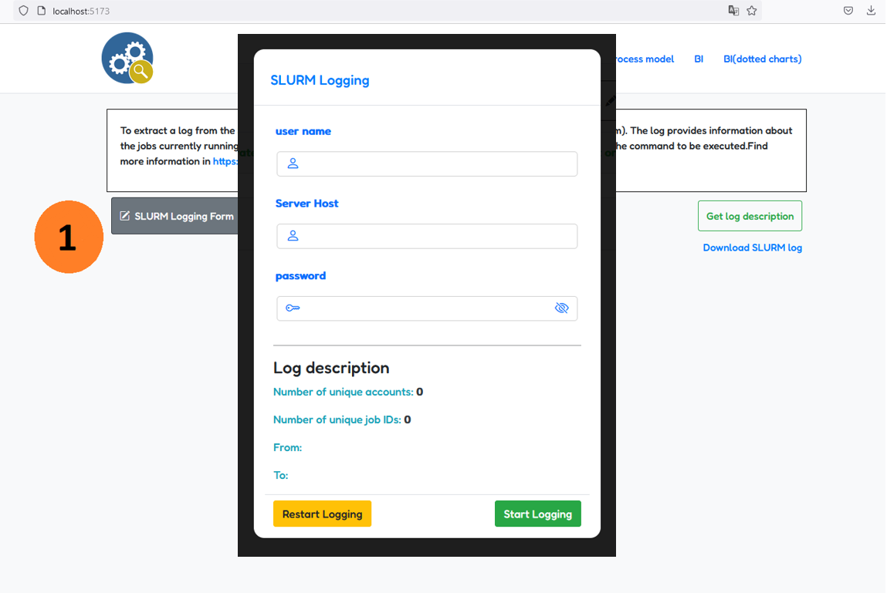
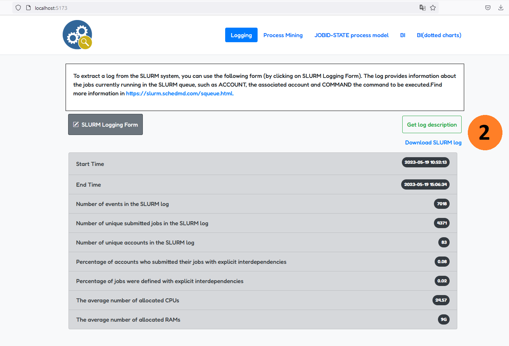
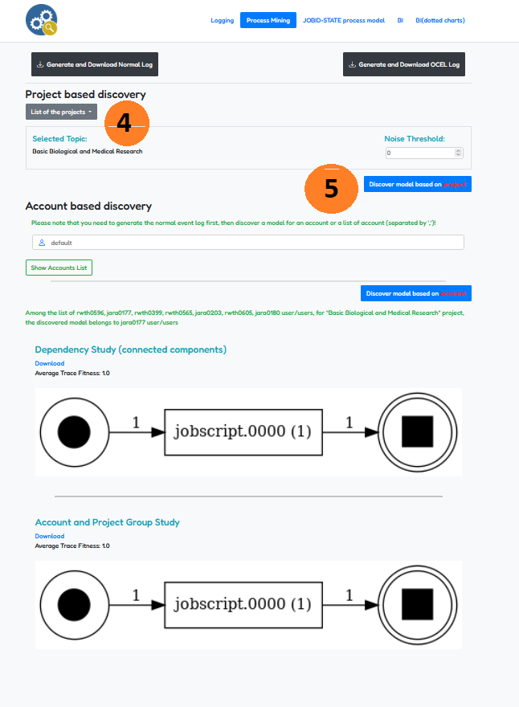
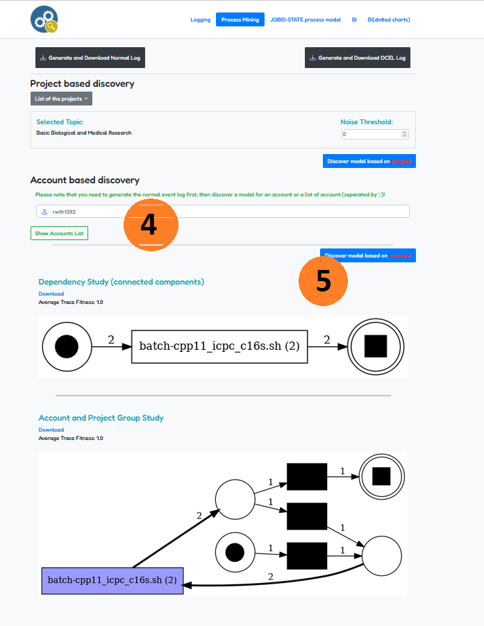
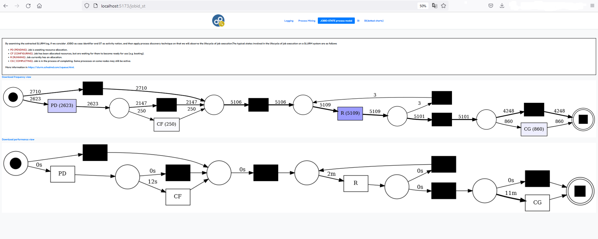
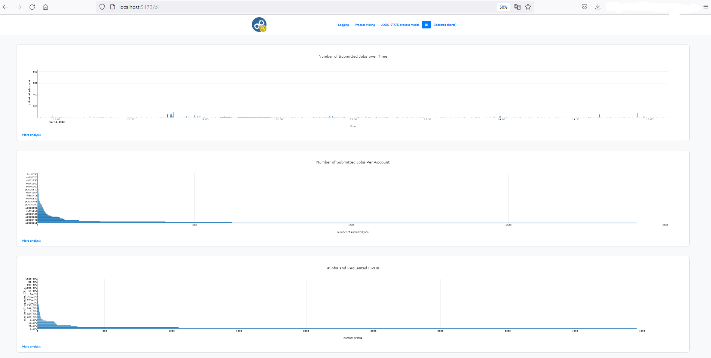
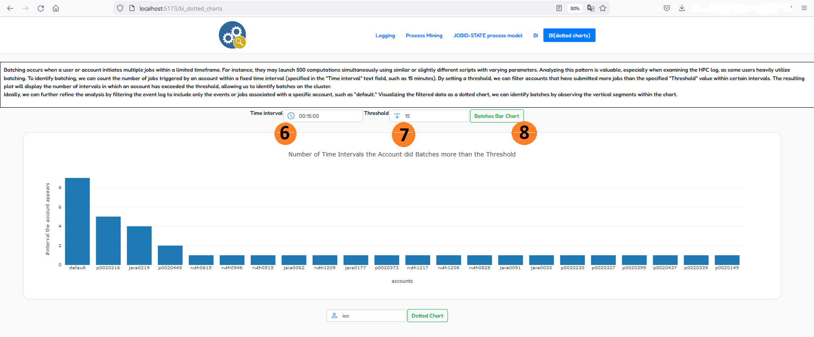
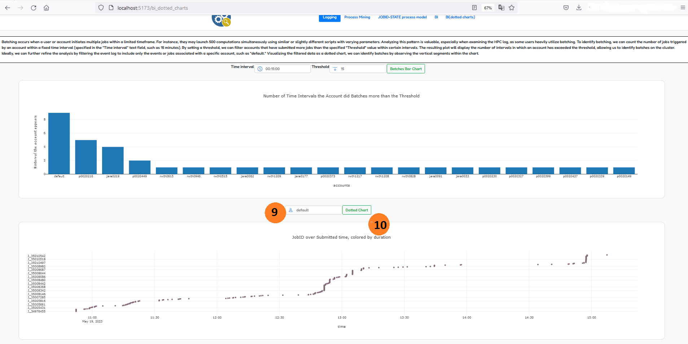

# hpc_monitoring_cocpit

## 0. How to

### Installation Procedure

- Download Node. js 
    - Download the Node.js Installer from the official website at https://nodejs.org/en/download/.
    - Proceed with the installation process, ensuring both Node.js and NPM (Node Package Manager) are installed.
    - Confirm the successful installation by opening a command prompt (or PowerShell) and entering the command "node -v".
- Verify the availability of Python on your system.
- Check if PIP is already installed.
- Utilizing the GitHub platform, clone the desired project repository by executing the command "git clone https://github.com/zasab/hpc_monitoring_cocpit.git" and open the project in any Integrated Development Environment (IDE).

### Execution Procedure

1. Run the "app.py" script and employ the "pip install" command to install all the required packages. You can find a list of some package requirements in the requirements.txt file. Just run (*pip install pm4py==2.3.3 flask flask_api flask_cors hurry.filesize seaborn plotly pysftp paramiko pandas==1.5.3 networkx humanfriendly*) to install all requirements.
2. Within the "DEV-front" directory, execute the commands "npm install" and "npm run dev" (Node.js is required).
   - Open the URL indicated as "⇒ Local:" in your web browser to access the application.

## 1. Overview

##### The tabs labeled *Process Mining and JOBID-STATE process model* contain fascinating analysis on process mining.

##### Discover a model that shows the executed commands by a bunch of accounts in a particular project.

##### OR find a model that shows the commands used by a particular account.

##### You can find interesting insights in the discovered model that shows the lifecycle of job execution on SLURM.

##### You can find interesting analysis in *BI and BI(dotted charts)* tabs

